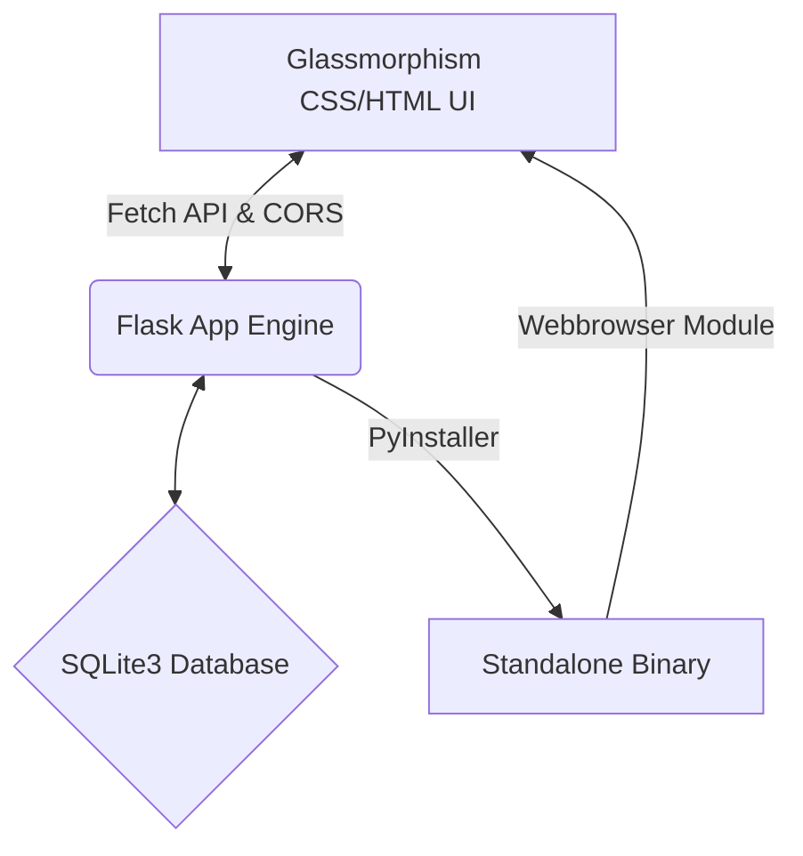

# 🚀 Nexus CRM — Enterprise Executive Dashboard

Welcome to **Nexus CRM**, a premium, high-fidelity Client Relationship Management (CRM) platform designed specifically for executives and CEOs. Nexus CRM bridges a state-of-the-art glassmorphism Single Page Application (SPA) frontend with a production-ready Python Flask backend and an optimized SQLite database schema. It is built to run flawlessly in local development as well as compile into a standalone, one-click desktop executable.

---

## 🌟 Premium Features

- **📊 CEO Executive Dashboard**: Consolidated view of key metrics (Total Clients, Active Appointments, Pending Follow-ups, and Completion Rates), today's schedules, upcoming meetings, and overdue follow-up alerts.
- **💼 Comprehensive Client Profiles**: Scoped data tracking client names, phone numbers, corporate affiliations, specific industry types, products of interest, internal observations, and unique custom client requests.
- **📅 Advanced Appointment Scheduler**: Seamless scheduling panel allowing meetings to be linked directly to client profiles, tracking locations, times, agendas, and statuses (Pending, Completed, Cancelled).
- **🔄 Robust Follow-Up Engine**: Intelligent customer relation workflows categorizing contact modes (Call, WhatsApp, Email, Meeting, Demo) with built-in alarms for overdue actions.
- **🔍 Global Omni-Search**: Instant search bar with real-time indexing across client names, corporate divisions, products, and contact numbers. Backed by a lightning-fast keyboard shortcut (`Ctrl + K`).
- **⚙️ Dynamic User Settings**: Scoped settings panel featuring personal adjustments for reminder triggers and responsive UI themes.
- **🎨 Glassmorphic Premium UI**: Beautiful dark mode styled with harmonized HSL variables, fluid gradients, glass-like transparency backdrops, responsive grid elements, and smooth micro-animations.
- **📦 Desktop-Ready Executable**: Automatic cross-platform bundling script utilizing PyInstaller to package the entire backend and frontend into a single `NexusCRM` binary that launches an isolated Flask thread and auto-opens in the default browser.

---

## 🏗️ Tech Stack & Architecture



### 1. The Frontend (SPA)
- **Structure**: Semantic HTML5 containing modular slide-over modal sheets and a grid-based interface.
- **Styling**: Tailored vanilla CSS architecture (`css/style.css` and `css/aesthetic.css`) leveraging high-contrast typography, interactive variables, shadow layers, blur backdrops, and active-state scales.
- **Interaction**: Vanilla ES6 classes and componentized architectures (`js/api.js`, `js/app.js`, `js/components/`) handling API client communications, session tokens, dynamic UI mounts, global event listeners, and live notifications.

### 2. The Backend (Python)
- **Engine**: Flask utilizing the **Application Factory** pattern to secure localized setup, custom configurations, and separation of concern principles.
- **Security**: Cryptographic password hashing powered by `Werkzeug.security` alongside HTTPOnly and SameSite Session cookies.
- **Routing**: Blueprint routing segregation (`auth`, `clients`, `appointments`, `followups`, `dashboard`, `settings`, `reminders`).
- **Audit Trails**: Structured logging and live server request monitoring utilizing custom-formatted logging handlers.

### 3. The Database (SQLite3)
- Normalized SQLite database layout utilizing relational foreign keys, cascade deletes, indexed columns for query speed, and soft deletes.

---

## ⚙️ Local Development Setup

To run Nexus CRM on your local development machine, follow the steps below:

### 1. Clone & Navigate
```bash
git clone <your-repo-url>
cd internal_tools/crm/backend
```

### 2. Configure Virtual Environment
Create and activate a isolated virtual environment to keep your global packages clean:
```bash
# Windows
python -m venv venv
venv\Scripts\activate

# macOS/Linux
python3 -m venv venv
source venv/bin/activate
```

### 3. Install Dependencies
Install Flask, Flask-CORS, and required packages:
```bash
pip install -r requirements.txt
```

### 4. Create and Seed Database
Run the seed script to reset your database file and load robust mock data for testing:
```bash
python seed_data.py
```
*This command creates `/database/crm.db` automatically and initializes two primary user accounts.*

### 5. Launch Development Server
```bash
python app.py
```
- By default, the server runs on `http://127.0.0.1:5001`.
- Open `crm/frontend/index.html` in your web browser, or navigate directly to `http://127.0.0.1:5001` if serving static assets directly.

### 🔑 Demo Logins
Use these pre-seeded credentials to explore the platform:
- **Administrator**: Username: `admin` | Password: `admin`
- **Standard Account (With Seed Data)**: Username: `demo` | Password: `demo`

---

## 📦 Compiling Standalone Desktop Executable

Nexus CRM contains a dedicated automated build utility (`build.py`) that uses **PyInstaller** to compile the complete Flask server, its database blueprints, and the static HTML/CSS/JS frontend into a **single binary file** that requires zero runtime installations.

### How it works:
1. `build.py` checks if PyInstaller is present (and installs it if missing).
2. It detects the operating system to configure file separators.
3. It kills any active background processes running `NexusCRM.exe` to prevent write locks.
4. It reads `NexusCRM.spec` and compiles the project into a compact, console-free desktop app.
5. In the packaged executable, `launcher.py` starts the server in an isolated thread, opens your browser automatically, and serves the frontend out of the internal temporary `sys._MEIPASS` folder. The active database is securely placed in `~/.nexus_crm/crm.db` inside your OS user's directory.

### Build Executable:
Ensure your virtual environment is active and run:
```bash
python build.py
```
After completion, your executable is built under:
- **Windows**: `crm/backend/dist/NexusCRM.exe`
- **macOS/Linux**: `crm/backend/dist/NexusCRM`

---


*Crafted with 🚀 by the Deepmind Antigravity Pair Programming team for Streamux AI.*
